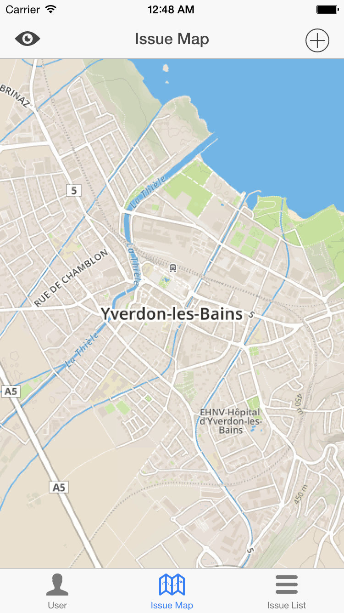
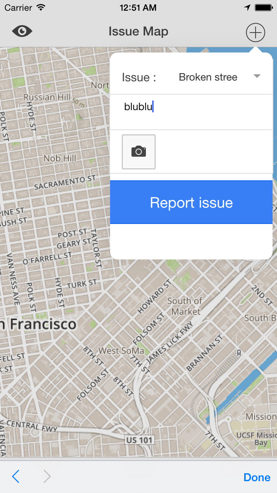
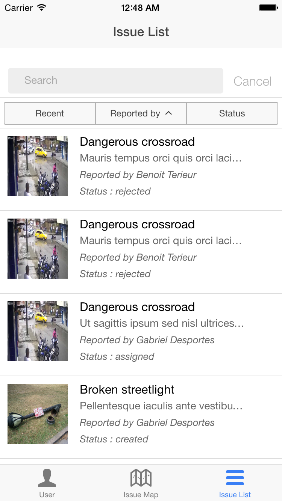
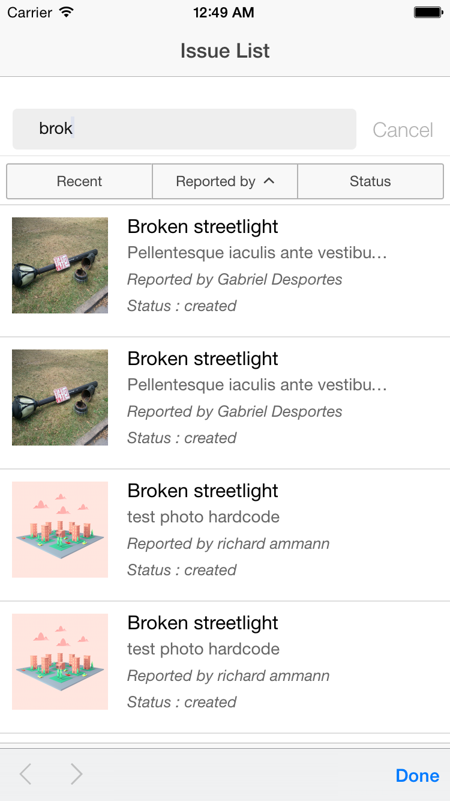
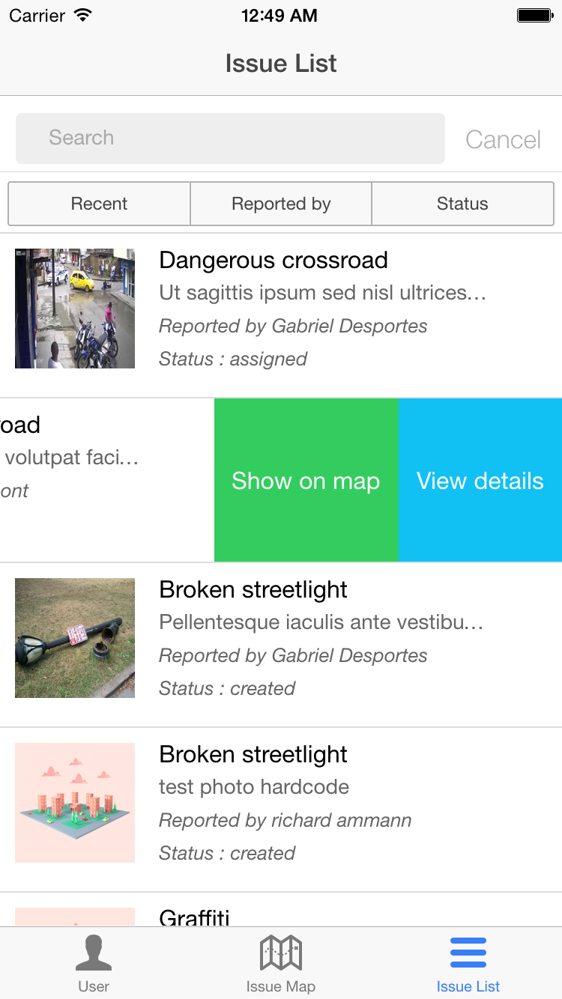
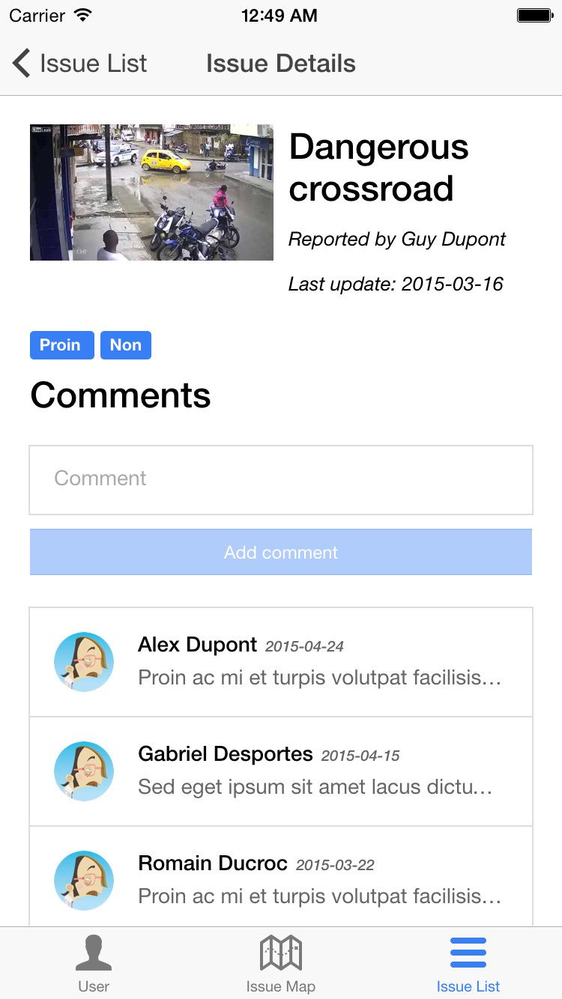
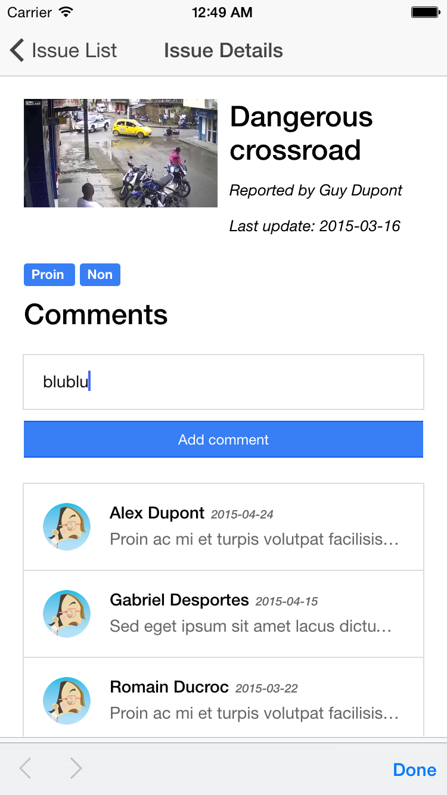
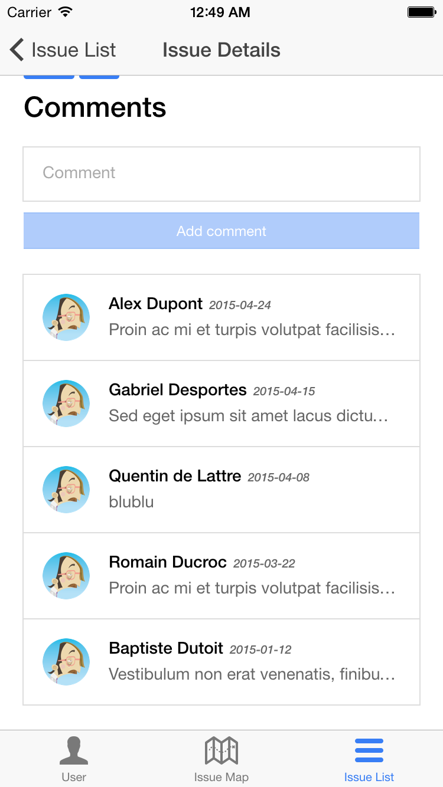
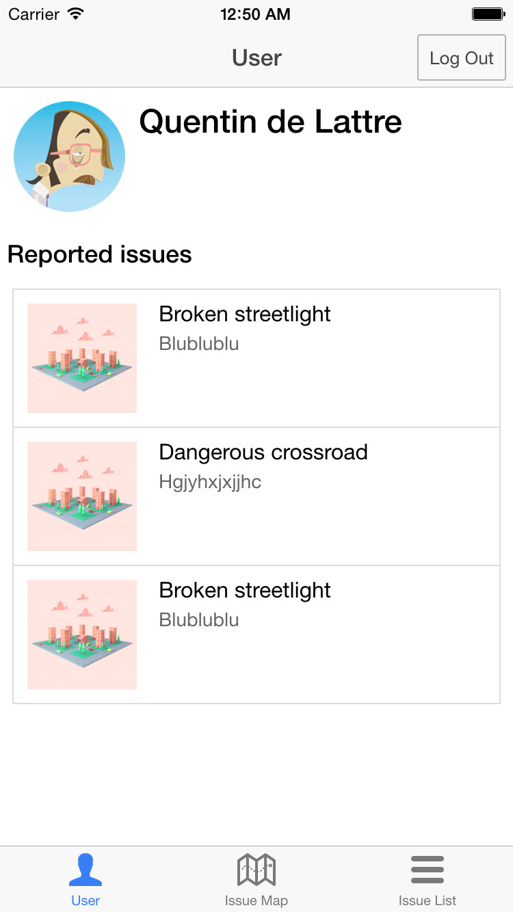
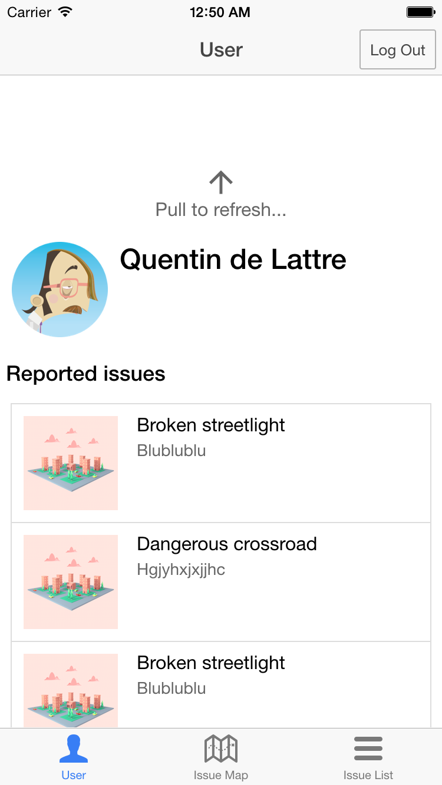

# Fix your city

## It’s just a finger’s tap away !

#### Finally, our wonderful app is out !

We are thrilled to announce the official launch of the the Citizen Engagement App for iOS straight from our R&Q’s labs. So thrilled that we are going to walk you through its functionalities right here, right now. Hold on tight !

Well, as usual, comes the login screen. Not a member yet ? No worries ! Just type your name and last name, and we’ll set you up, just like that !

You’re in ! The first thing you notice, of course, is the full screen map. From there, you can navigate among the reported issues and most importantly, you can report new issues by tapping the [+] button, then selecting your issue, adding a short description, and a snap if y’all’ got time !

We’ve also got a list of all issues, with infinite scroll, cause there’s so many of them; we’ve also got a list of all issues, with infinite scroll, cause there’s so many of them; we’ve also got a list of all issues, with infinite scroll, cause there’s so many of them; we’ve also got a list of all issues, with infinite scroll, cause there’s so many of them; we’ve also got a list of all issues, with infin… right, you got it.

You can sort it however you like, and search any of your favorite, ain’t that wonderful ?! 

And when you found the One, just swipe left, and you can either show it on the map, or see its details and comment on it.

But what about yourself, what about your own citizen engagement ? Well, we thought of that ! You can find your own reported issues, and all the same, see their details, or find them on the map !

So remember, if you can fix it, snap it !
It is your Citizen Engagement !

All the best !

Richard, Quentin.